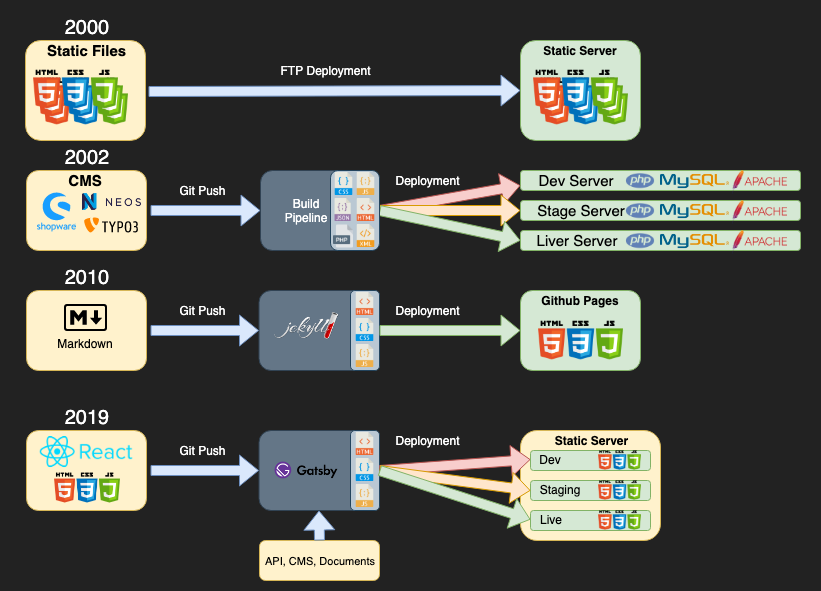

# Static Site Generators

Jekyll, Next, Gatsby...

---

## Es war einmal, das Internet...

---
_2000:_

Static HTML (Frames, Viele einzelne HTML Dokumente)
Static CSS
Static JS

_2002:_

Erste WCMS (Post Nuke, PHP Nuke, PHP Kit usw.)
CMS Rendert dynamisch HTML aus Templates und Content
HTML wird vom CMS ausgeliefert

_24 Jun 2010:_

Jekyll wird von Github Cofounder released
Sinn war aus Textfiles, Markdown und APIs  automatisch Github Pages zu erstellen
Jekyll basiert auf Ruby

_Wenige Jahre später:_

Unter anderem entstehen static site generatoren mit React.js als Viewlayer
Static Site Generatoren und Serverside Rendering mit den selben Komponenten möglich

---

# Funktionsweise

(_ToDo: Visualisierung der Punkte als Flussdiagramm_)

- Content wird einfach aus Markdown files, REST API, GraphQL oder JSON Api eines, oder mehrerer CMS gelesen.
- Statische Seiten werden generiert
- Seiten werden zum Hoster deployed

---

# Vorteile

- Sehr einfaches Hosting (html, css, js)
- Entwicklung unabhängig vom Backend (MVP) -> Schnelle Iterationen
- Datenquelle (CMS, API) kann ausgetauscht werden, ohne die eigentliche Website neu implementieren zu müssen
- Security: Keine Ausführung von serverseitigem Code -> Weniger Sicherheitslücken

# Nachteile

- Changes am Content werden erst nach Build und Deployment sichtbar

---

# Verbreitete Generatoren

