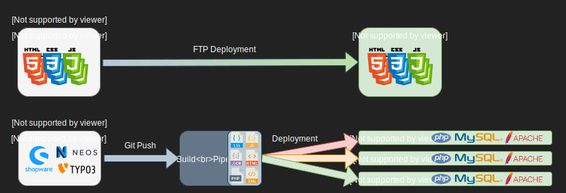
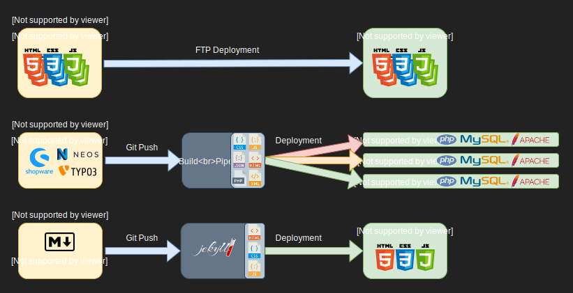
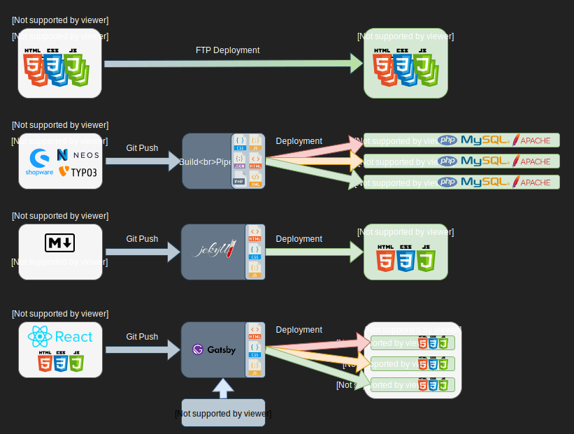
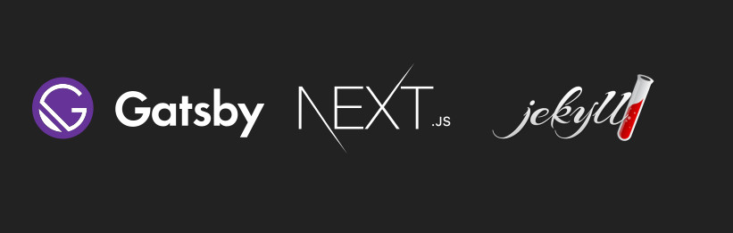

# Static Site Generators

Jekyll, Next, Gatsby...

---

## Eine kurze Geschichte der Webentwicklung...

---

---

---

---

---

# Funktionsweise

(_ToDo: Visualisierung der Punkte als Flussdiagramm_)

- Content wird einfach aus Markdown files, REST API, GraphQL oder JSON Api eines, oder mehrerer CMS gelesen.
- Statische Seiten werden generiert
- Seiten werden zum Hoster deployed

---

# Vorteile

- Sehr einfaches Hosting (html, css, js)
- Entwicklung unabhängig vom Backend (MVP) -> Schnelle Iterationen
- Datenquelle (CMS, API) kann ausgetauscht werden, ohne die eigentliche Website neu implementieren zu müssen
- Security: Keine Ausführung von serverseitigem Code -> Weniger Sicherheitslücken

# Nachteile

- Changes am Content werden erst nach Build und Deployment sichtbar

---

# Verbreitete Generatoren

