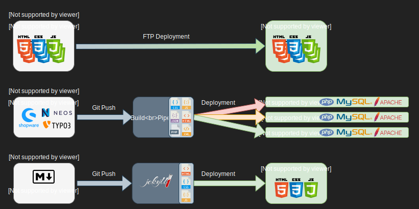

# Static Site Generators

Jekyll, Next, Gatsby...

---

## Eine kurze Geschichte der Webentwicklung...

---

---

---

---

---

## Vorteile

- Sehr einfaches Hosting (html, css, js)
- Entwicklung unabhängig vom Backend (MVP) -> Schnelle Iterationen
- Datenquelle Austauschbar (CMS, API, Files)
- Security: Keine Ausführung von serverseitigem Code -> Weniger Sicherheitslücken

## Nachteile

- Changes am Content werden erst nach Build und Deployment sichtbar

---

## Verbreitete Generatoren

