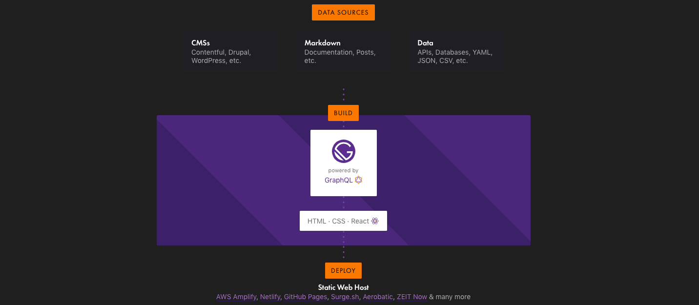
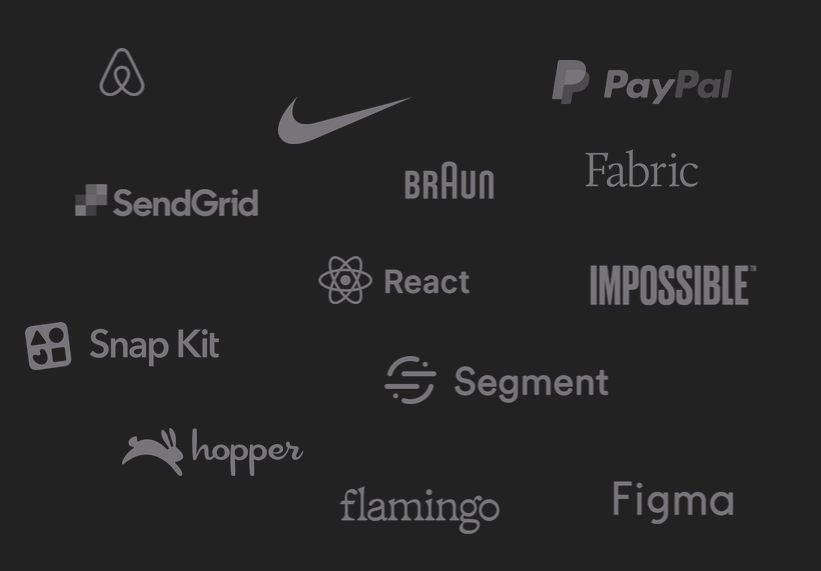

# 

---

## Workflow

(_ToDo: Visualisierung der Punkte als Flussdiagramm_)

- React (Build the Frontend MVP)

- Gatsby (Add pages and static Content) -> go online

If content changes fast and often

- Gatsby with API (get content from an API, or Headless CMS)

If there are to much pages

- Next.js with reusable React Components from Gatsby

---

## Funktionsweise

---

## Benefits

- MVP Test vor CMS.
- MVP kann ohne großes CMS Setup Live gehen,
- CMS kann wenn nötig nachgereicht werden.
- Progressive Web App möglich
- Performance und Code SEO Optimiert
- Daten aus mehreren Apis gleichzeitig (CMS, GraphQL, Rest, Markdown,.....)
- Austausch Datenquelle ohne Seiteneffekte im Frontend
- React Components Wiederverwendbar (z.B. in Next.js, oder RCA)
- Security: Keine serverseitiger Ausführung von Code (kein php, node, mysql...)
- Living Syleguide: Storybook, Styleguidist
- Deployment: Weniger Daten werden übertragen -> schnellere Deployment

---

## Trusted by

