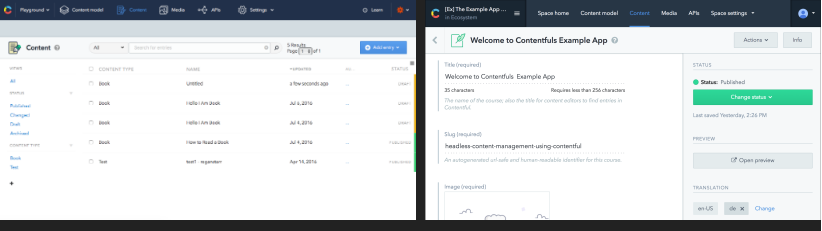
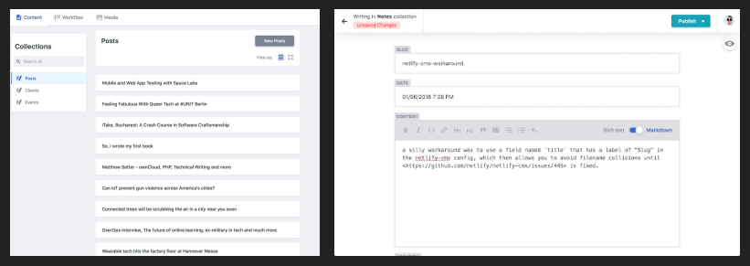
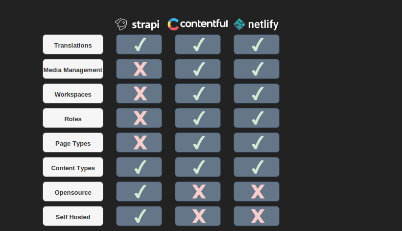

# Headless CMS als DataSource für Gatsby

   (_ToDO: Logos_)
   Contentful, Netlify CMS, Strapi

---

## Funktionsweise

(ToDO: Visualisierung: Content -> Api -> Build)

---

## Contentful

__Hosting:__ Cloud (kostenpfl.)

---

## Netlify CMS

__Hosting:__ Cloud (kostenpfl.)

---

## Strapi

__Hosting:__ Selbst (opensource)

---

#### Features:

---

#### Features:

---
